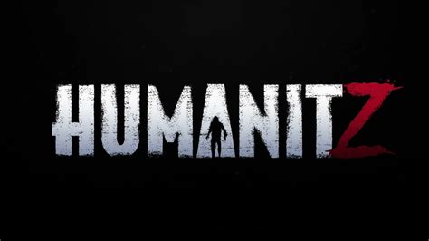

<!-- =============================== -->
<!--  HUMANITZ WIKI – FRONT PAGE     -->
<!--  Branding: Orange/Black Theme   -->
<!--  Color: #E79543 (Primary)       -->
<!-- =============================== -->

<link rel="stylesheet" href="assets/css/humanitz.css">

<!-- STICKY NAV (Works on GitHub Pages) -->

  <a href="index.md" style="color:#E79543; margin:0 12px;">🏠 Home</a>
  <a href="game-overview.html" style="color:#E79543; margin:0 12px;">🧭 Overview</a>
  <a href="Getting-Started.md" style="color:#E79543; margin:0 12px;">🎒 Getting Started</a>
  <a href="Survival-Mechanics.md" style="color:#E79543; margin:0 12px;">🍖 Survival</a>
  <a href="Base-Building.md" style="color:#E79543; margin:0 12px;">🏠 Base</a>
  <a href="Loot-Crafting.md" style="color:#E79543; margin:0 12px;">🔧 Crafting</a>
  <a href="Weapons-&-Gear.md" style="color:#E79543; margin:0 12px;">🔫 Weapons</a>
  <a href="Enemies-&-Threats.md" style="color:#E79543; margin:0 12px;">🧟 Enemies</a>
  <a href="Map-&-Environments.md" style="color:#E79543; margin:0 12px;">🗺️ Map</a>
  <a href="Multiplayer-&-Co-op.md" style="color:#E79543; margin:0 12px;">🤝 Co-op</a>
  <a href="Tips-&-Strategy.md" style="color:#E79543; margin:0 12px;">💡 Tips</a>
  <a href="Glossary.md" style="color:#E79543; margin:0 12px;">🔤 Glossary</a>
  <a href="Contribute.md" style="color:#E79543; margin:0 12px;">🛠️ Contribute</a>

<!-- LOGO -->

  

<h1 align="center" style="color:#E79543; margin-top:0;">
  HumanitZ – Community Wiki
</h1>

A survival-focused, player-maintained knowledge base for the world of <strong>HumanitZ</strong>.
 
Built with love by survivors, for survivors.

---

# 📚 Wiki Index

  
| Section | Description |
|--------|-------------|
| 🧭 **[Game Overview](Game-Overview.md)** | Understand the world, lore, and core gameplay pillars. |
| 🎒 **[Getting Started](Getting-Started.md)** | Your first day, first base, first weapons, first survival wins. |
| 🍖 **[Survival Mechanics](Survival-Mechanics.md)** | Hunger, thirst, cold, injuries, weather, and permadeath. |
| 🏠 **[Base Building](Base-Building.md)** | Construction, fortifications, farms, outposts, garages. |
| 🔧 **[Loot & Crafting](Loot-Crafting.md)** | All crafting systems, recipes, harvesting, refining. |
| 🔫 **[Weapons & Gear](Weapons-&-Gear.md)** | All weapons, melee, ranged, armor, backpack tiers. |
| 🧟 **[Enemies & Threats](Enemies-&-Threats.md)** | Zeek types, wildlife, environmental hazards. |
| 🗺️ **[Map & Environments](Map-&-Environments.md)** | Biomes, POIs, weather system, travel, vehicles. |
| 🤝 **[Multiplayer & Co-op](Multiplayer-&-Co-op.md)** | Hosting, strategies, team roles, base-sharing. |
| 💡 **[Tips & Strategy](Tips-&-Strategy.md)** | Beginner → advanced survival strategies. |
| 🔤 **[Glossary](Glossary.md)** | All key terms, systems, abbreviations. |
| 🛠️ **[Contribute](Contribute.md)** | Help build and improve the Wiki. |

---

# 🎮 What Is HumanitZ?

HumanitZ is a **top-down open-world survival game** set in a collapsing society overrun by **zeeks** (zombies).  
It's a slow-burn, atmospheric survival experience with:

- ⚔️ **Lethal combat**
- 🧱 **Deep base-building**
- 🌾 **Farming, hunting, fishing**
- 🚗 **Vehicles and repairs**
- 🧭 **Open-world exploration**
- 👥 **Co-op multiplayer**
- 💀 **Optional permadeath**

Everything you do matters. Every decision has consequences.

---

# 🏗️ Wiki Philosophy

This Wiki aims to:

- Provide **accurate**, structured, stylish information  
- Fill gaps the official resources leave  
- Guide newcomers without spoiling discovery  
- Serve as a long-term **knowledge archive**  
- Create the cleanest HumanitZ documentation available  

---

# 🧩 Collapsible Quick Reference

<strong style="color:#E79543;">🛠️ Core Systems</strong>

- Survival  
- Crafting  
- Farming  
- Looting  
- Combat  
- Weather  
- Vehicles  
- Base defense  

<strong style="color:#E79543;">🗺️ Exploration</strong>

- Biomes  
- Map markers  
- Points of interest  
- Indoor/Outdoor threats  

<strong style="color:#E79543;">🧟 Enemy Types</strong>

- Slow zeeks  
- Runners  
- Special variants  
- Animals  
- Environmental dangers  

---

# 🛠️ Contribute to the Wiki

Help us expand the knowledge of HumanitZ.

See **[Contribute.md](Contribute.md)** for:

- Style rules  
- Page structure  
- Navigation rules  
- PR guidelines  
- Content accuracy standards  

---

<i>In the end of the world, knowledge is survival.</i>

